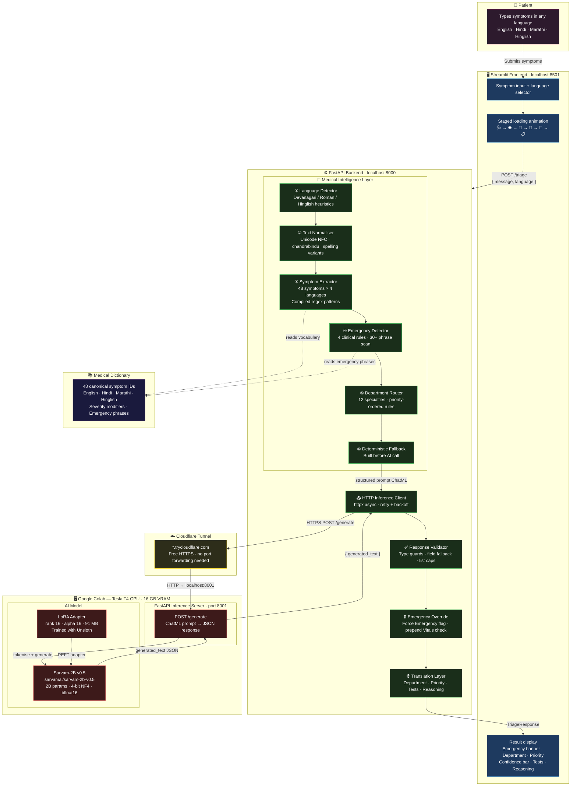
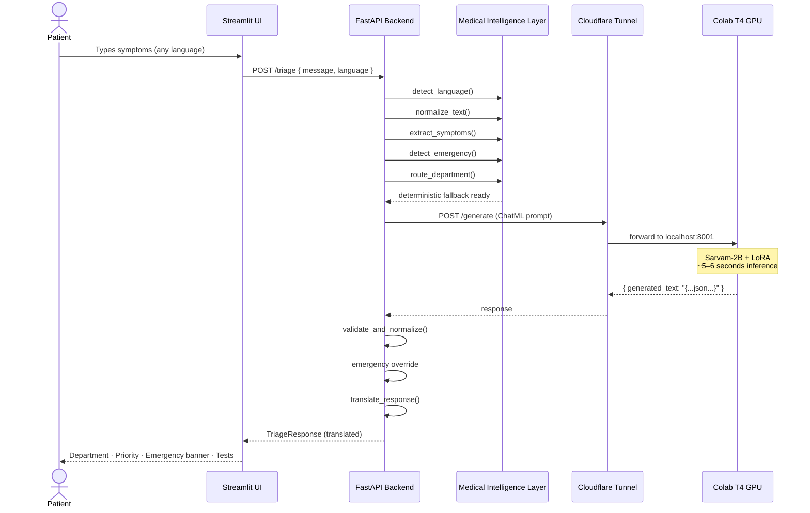
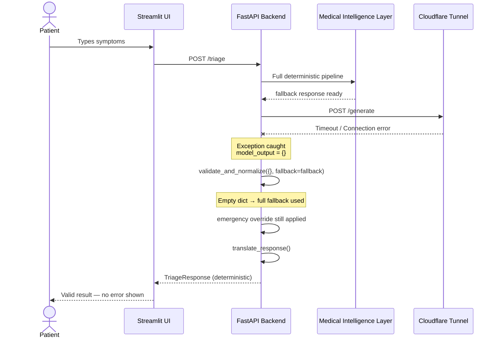
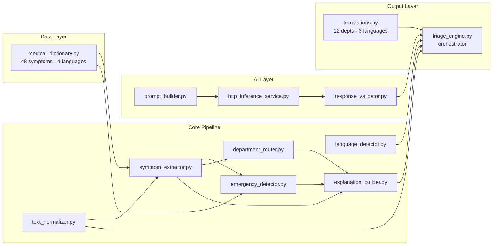

# MedRoute AI — Architecture Diagram

## Full System Diagram

```mermaid
flowchart TD
    subgraph USER["👤 Patient"]
        A["Types symptoms in any language\nEnglish · Hindi · Marathi · Hinglish"]
    end

    subgraph FRONTEND["🖥️ Streamlit Frontend · localhost:8501"]
        B["Symptom input + language selector"]
        C["Staged loading animation\n🩺 → 🌐 → 🧠 → 🏥 → 🤖 → 📋"]
        D["Result display\nEmergency banner · Department · Priority\nConfidence bar · Tests · Reasoning"]
    end

    subgraph BACKEND["⚙️ FastAPI Backend · localhost:8000"]
        subgraph MIL["🧠 Medical Intelligence Layer"]
            E["① Language Detector\nDevanagari / Roman / Hinglish heuristics"]
            F["② Text Normaliser\nUnicode NFC · chandrabindu · spelling variants"]
            G["③ Symptom Extractor\n48 symptoms × 4 languages\nCompiled regex patterns"]
            H["④ Emergency Detector\n4 clinical rules · 30+ phrase scan"]
            I["⑤ Department Router\n12 specialties · priority-ordered rules"]
            J["⑥ Deterministic Fallback\nBuilt before AI call"]
        end

        K["📤 HTTP Inference Client\nhttpx async · retry + backoff"]
        L["✅ Response Validator\nType guards · field fallback · list caps"]
        M["🔒 Emergency Override\nForce Emergency flag · prepend Vitals check"]
        N["🌐 Translation Layer\nDepartment · Priority · Tests · Reasoning"]
    end

    subgraph DICT["📚 Medical Dictionary"]
        O["48 canonical symptom IDs\nEnglish · Hindi · Marathi · Hinglish\nSeverity modifiers · Emergency phrases"]
    end

    subgraph TUNNEL["☁️ Cloudflare Tunnel"]
        P["*.trycloudflare.com\nFree HTTPS · no port forwarding needed"]
    end

    subgraph COLAB["🖥️ Google Colab — Tesla T4 GPU · 16 GB VRAM"]
        subgraph INFERENCE["FastAPI Inference Server · port 8001"]
            Q["POST /generate\nChatML prompt → JSON response"]
        end
        subgraph MODEL["AI Model"]
            R["Sarvam-2B v0.5\nsarvamai/sarvam-2b-v0.5\n2B params · 4-bit NF4 · bfloat16"]
            S["LoRA Adapter\nrank 16 · alpha 16 · 91 MB\nTrained with Unsloth"]
        end
    end

    A -->|"Submits symptoms"| B
    B --> C
    C -->|"POST /triage\n{ message, language }"| BACKEND

    E --> F --> G --> H --> I --> J
    G -.->|"reads vocabulary"| O
    H -.->|"reads emergency phrases"| O

    J -->|"structured prompt ChatML"| K
    K -->|"HTTPS POST /generate"| P
    P -->|"HTTP → localhost:8001"| Q
    Q -->|"tokenise + generate"| R
    S -.->|"PEFT adapter"| R
    R -->|"generated_text JSON"| Q
    Q -->|"{ generated_text }"| K
    K --> L
    L --> M
    M --> N
    N -->|"TriageResponse"| D

    classDef frontend fill:#1e3a5f,stroke:#4fa3e0,color:#fff
    classDef backend fill:#1a2e1a,stroke:#28a745,color:#fff
    classDef ai fill:#3d1a1a,stroke:#ff6b6b,color:#fff
    classDef infra fill:#2d2d1a,stroke:#ffd700,color:#fff
    classDef dict fill:#1a1a3d,stroke:#9b59b6,color:#fff
    classDef user fill:#2d1a2d,stroke:#e91e8c,color:#fff

    class A user
    class B,C,D frontend
    class E,F,G,H,I,J,K,L,M,N backend
    class R,S,Q ai
    class P infra
    class O dict
```

---

## Request Flow (Happy Path)

```mermaid
sequenceDiagram
    actor Patient
    participant UI as Streamlit UI
    participant API as FastAPI Backend
    participant NLP as Medical Intelligence Layer
    participant CF as Cloudflare Tunnel
    participant GPU as Colab T4 GPU

    Patient->>UI: Types symptoms (any language)
    UI->>API: POST /triage { message, language }

    API->>NLP: detect_language()
    API->>NLP: normalize_text()
    API->>NLP: extract_symptoms()
    API->>NLP: detect_emergency()
    API->>NLP: route_department()
    NLP-->>API: deterministic fallback ready

    API->>CF: POST /generate (ChatML prompt)
    CF->>GPU: forward to localhost:8001

    Note over GPU: Sarvam-2B + LoRA<br/>~5–6 seconds inference

    GPU-->>CF: { generated_text: "{...json...}" }
    CF-->>API: response

    API->>API: validate_and_normalize()
    API->>API: emergency override
    API->>API: translate_response()
    API-->>UI: TriageResponse (translated)

    UI-->>Patient: Department · Priority · Emergency banner · Tests
```

---

## Fallback Path (Model Unavailable)

```mermaid
sequenceDiagram
    actor Patient
    participant UI as Streamlit UI
    participant API as FastAPI Backend
    participant NLP as Medical Intelligence Layer
    participant CF as Cloudflare Tunnel

    Patient->>UI: Types symptoms
    UI->>API: POST /triage

    API->>NLP: Full deterministic pipeline
    NLP-->>API: fallback response ready

    API->>CF: POST /generate
    CF--xAPI: Timeout / Connection error

    Note over API: Exception caught<br/>model_output = {}

    API->>API: validate_and_normalize({}, fallback=fallback)
    Note over API: Empty dict → full fallback used

    API->>API: emergency override still applied
    API->>API: translate_response()
    API-->>UI: TriageResponse (deterministic)

    UI-->>Patient: Valid result — no error shown
```

---

## Component Dependency Map

```mermaid
flowchart LR
    subgraph CORE["Core Pipeline"]
        LD["language_detector.py"]
        TN["text_normalizer.py"]
        SE["symptom_extractor.py"]
        ED["emergency_detector.py"]
        DR["department_router.py"]
        EB["explanation_builder.py"]
    end

    subgraph DATA["Data Layer"]
        MD["medical_dictionary.py\n48 symptoms · 4 languages"]
    end

    subgraph AI["AI Layer"]
        PB["prompt_builder.py"]
        HI["http_inference_service.py"]
        RV["response_validator.py"]
    end

    subgraph OUTPUT["Output Layer"]
        TR["translations.py\n12 depts · 3 languages"]
        TE["triage_engine.py\norchestrator"]
    end

    MD --> SE
    MD --> ED
    TN --> SE
    LD --> TE
    TN --> TE
    SE --> ED
    SE --> DR
    SE --> EB
    ED --> EB
    DR --> EB
    EB --> TE
    PB --> HI
    HI --> RV
    RV --> TE
    TR --> TE
```
